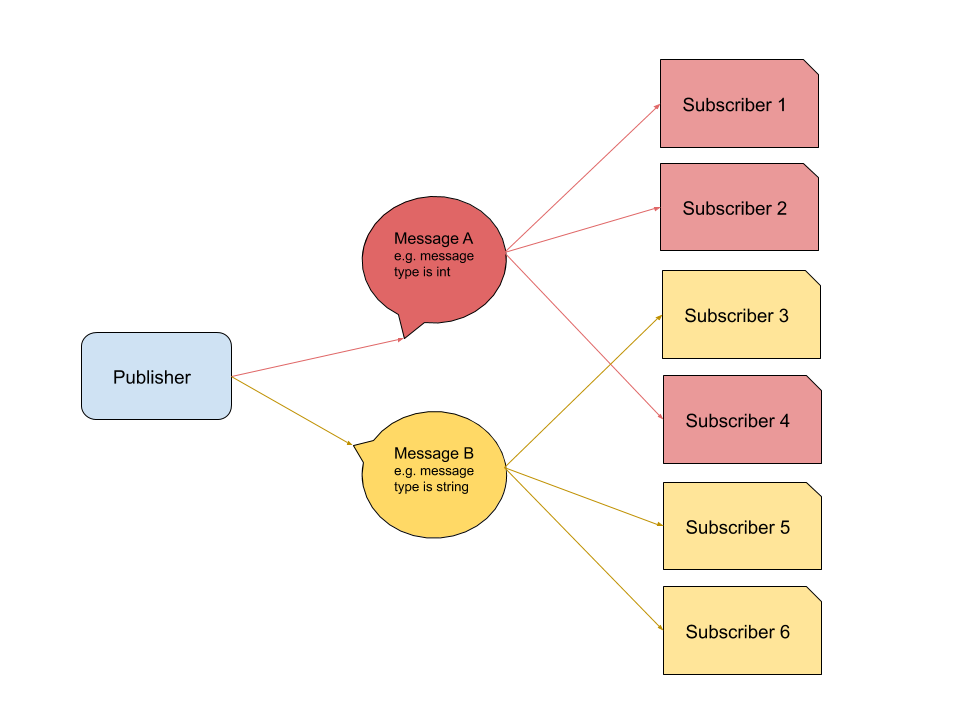
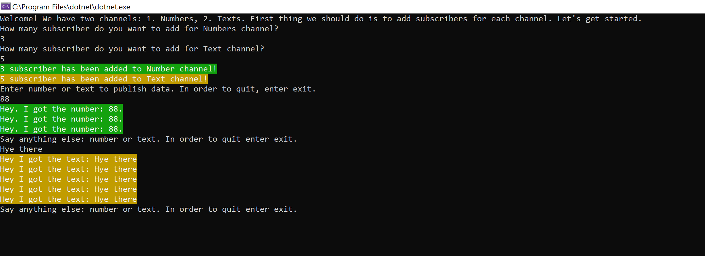

# Publisher/Subscriber Pattern
This is a C# .Net Core Console Application to demonstrate Publish/Subscriber pattern

#### Table of content
1. [Quick Start](#quick-start)
2. [Prerequisites](#prerequisites)
3. [Publisher/Subscriber pattern](#publisher/subscriber-pattern)
5. [TODOs](#todos)

## Quick Start
Several quick start options are available:
- [Download latest release](https://github.com/mosarsh/Publish-Subscribe-Pattern/archive/master.zip)
- Clone the repo: `git clone git@github.com:mosarsh/Publish-Subscribe-Pattern.git`

## Prerequisites
- Visual Studio
   
## Publisher/Subscriber patten
Publisher/Subscriber pattern is one of the variations of the Observer designer pattern. This is working very simple: publisher triggers a message and there are one or more Subscriber to particular message who listen to published message. Below image demonstrate how it works.

To achieve Publisher/Subscriber pattern has been used Event/Delegate. Here are the drawbacks of this approach:
1. For publishing Different type of message there is need of creating different type of Publisher. For Example : Publisher<int> - for integer type,  publisher Publisher<string> - for string type.
2. Tight Coupling bettwen Publisher and Subscriber. In this pattern Subscriber require to know publisher as they subscribe to event of publisher.
   
With this application you can create subscribers for message type int and string by giving how many subscriber you want to have from each one. Below see screenshot of app.

## TODOs
1. To enhane the application there is need to create event middle layer between publisher and subscriber to to break tight coupling. Publisher and Subscriber don't know each other. They both need to work with meedle layer.
